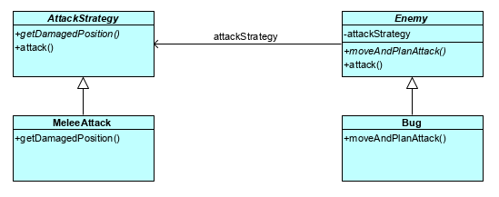

# LPOO_21 - Out Of The Breach

This project was developed by Clara Alves Martins (up201806528@fe.up.pt) and Daniel Filipe Amaro Monteiro (up201806185@fe.up.pt).

## Implemented Features
- **Interaction with the user** : Fully Implemented GUI with responsive window resizing.
- **Navigation keys** : Use the arrow keys, `M`, `A`, `Enter` and `Esc` no navigate the GUI.
- **Enemy AI** : Enemy intelligence depends on the enemy type, with Bug being the dumber and Dragon being the smarter. Bug will chase low health heroes or cities. If the weaker entity can’t be targeted, it won’t attack in that round. Lizard is a little bit smarter and very lazy so it will try to move the least number of tiles while prioritizing cities over heroes. The Dragon is the smarter one, being able to decide where to attack based on the number of cities, heroes and enemies it will damage. It will prioritize cities over heroes and it will avoid attacking other enemies. If the dragon is currently standing on a block that will be attacked, it won’t avoid attacking there since the dragon is gonna move and it won’t be standing there anymore at the time of the attack.
- **Hero Movement and Attack Rounds** : The hero can move around the grid and attack enemies. Once the hero has moved once, it won’t be able to move again until the end of the turn. Once the hero has attacked once, it won’t be able to attack or move anymore until that round ends.
- **Different Levels** : There are 12 different levels available to play in our game. They will contain a various number of cities, heroes and enemies. If the player can survive 4 turns without losing all the cities or all the allies, he will win. Otherwise, he will lose.

## Planned Features
- Leaving the current level by pressing ESC.

## Design
### The enemy should separate its moving strategy from its attack strategy
##### Problem in context
If the enemy contains both strategies, it violates the Single Responsibility Principle.
##### Pattern
In order to avoid violation of the Single Responsibility Principle, we use the Strategy Pattern, separating the enemy from its attack method (`AttackStrategy`). This allows us to easily change and design the types of attacks in our game. It will also help meeting the Open-Closed Principle as we can modify the enemy’s strategy of attack without modifying the enemy.
##### Implementation
The enemy contains a strategy to attack making the strategy independent from the enemy and making the enemy only responsible for moving himself.

These classes can be found in the following files:
- AttackStrategy : https://github.com/FEUP-LPOO/lpoo-2020-g21/blob/master/src/main/java/out_of_the_breach/model/AttackStrategy.java
- AOEAttack : https://github.com/FEUP-LPOO/lpoo-2020-g21/blob/master/src/main/java/out_of_the_breach/model/AOEAttack.java
- LineAttack : https://github.com/FEUP-LPOO/lpoo-2020-g21/blob/master/src/main/java/out_of_the_breach/model/LineAttack.java
- Enemy : https://github.com/FEUP-LPOO/lpoo-2020-g21/blob/master/src/main/java/out_of_the_breach/model/Enemy.java
- Bug : https://github.com/FEUP-LPOO/lpoo-2020-g21/blob/master/src/main/java/out_of_the_breach/model/Bug.java
- Lizard : https://github.com/FEUP-LPOO/lpoo-2020-g21/blob/master/src/main/java/out_of_the_breach/model/Lizard.java
- Dragon : https://github.com/FEUP-LPOO/lpoo-2020-g21/blob/master/src/main/java/out_of_the_breach/model/Dragon.java
##### Consequences
This allows us to isolate the attacking related logic from the moving related logic. It also allows us to introduce new strategies of attack without having to change the enemy. Even the dragon which calculates the best position in order to deal the most possible damage can change its strategy of attack without affecting its movement function.

### Composite pattern : 
The composite pattern is the core foundation of our GUI system. We leave here a rough UML sketch. (https://github.com/FEUP-LPOO/lpoo-2020-g21/tree/master/src/main/java/out_of_the_breach/GUI)

### MVC pattern : 
We managed to extract all the game logic to the model package (https://github.com/FEUP-LPOO/lpoo-2020-g21/tree/master/src/main/java/out_of_the_breach/model). However, the view and the controler are unified into the `GUIComponent`. This is more akin to the hierarquic MVC pattern.

## Known Code Smells and Refactoring Suggestions
Even after a code cleanup, there are still some code smells. We tried to minimize the code smells without making the code to complicated to read and understand. When the applicable refactors would make the code to complicated or unreadable, we chose not to refactor the code.

* **Switch Statements** \
We have a big switch operator in `Position.adjacentPos ( AttackDirection )`. In this case, we could use some refactorings such as Replace Type Code with Subclass or Replace Type Code with State / Strategy. However, we feel like that change may result in a much more confusing code as it will split important parts of our class and generate a but load of classes. \
`Position.adjacentPos ( AttackDirection )` : https://github.com/FEUP-LPOO/lpoo-2020-g21/blob/master/src/main/java/out_of_the_breach/model/Position.java (lines 92-174)

* **Comments** \ 
In the longer functions, comments help us keep up with the flow of execution. However, sometimes the comments could be replaced by easier to understand functions. This happens in the Enemy Subclasses inside the moveAndPlanAttack( ) method. To solve this smell, we could use Extract Method to allow us to have segmentation on our code and avoid big and complex functions. \
`Bug` function : https://github.com/FEUP-LPOO/lpoo-2020-g21/blob/master/src/main/java/out_of_the_breach/model/Bug.java (lines 38, 67) \
`Lizard` function : https://github.com/FEUP-LPOO/lpoo-2020-g21/blob/master/src/main/java/out_of_the_breach/model/Lizard.java (lines 31, 40, 50) \
`Dragon` function : https://github.com/FEUP-LPOO/lpoo-2020-g21/blob/master/src/main/java/out_of_the_breach/model/Dragon.java (lines 41, 50, 51, 64, 72, 76, 86)

* **Long Method** \
Some methods are bound to be longer as they contain a larger portion of logic. We could use Extract Method to reduce the length of the method body, relocating some code to other methods. \
`Bug` function : https://github.com/FEUP-LPOO/lpoo-2020-g21/blob/master/src/main/java/out_of_the_breach/model/Bug.java (lines 31-97) \
`Lizard` function : https://github.com/FEUP-LPOO/lpoo-2020-g21/blob/master/src/main/java/out_of_the_breach/model/Lizard.java (lines 29-70) \
`Dragon` function : https://github.com/FEUP-LPOO/lpoo-2020-g21/blob/master/src/main/java/out_of_the_breach/model/Dragon.java (moveAndPlanAttack : lines 36-99 ; calculatePontuation : lines 101-135)

* **Message Chains** \
To avoid the hard to read and understand message chains we can try to use temporary and meaningful variables to store part of the message so it becomes easier to understand.

* **Data Class** \
Some of our classes, such as `DamageMatrix` and `MovementMatrix`, can be considered Data Classes as they are mainly a storage for data used by other classes and have no methods other than setters and getters. To solve this smell, it would be appropriate to relocate some methods that use the data on those classes to the data class itself or perhaps even remove the data classes and store the data where it is really needed. In this situation, we feel like these data classes help us move the data between the model and the view so we chose not to remove them.\
All of our Levels can also be considered data classes as they mainly serve as a storage for our level information, not adding much in terms of functions or behaviour.\
`DamageMatrix` : https://github.com/FEUP-LPOO/lpoo-2020-g21/blob/master/src/main/java/out_of_the_breach/model/DamageMatrix.java \
`MovementMatrix` : https://github.com/FEUP-LPOO/lpoo-2020-g21/blob/master/src/main/java/out_of_the_breach/model/MovementMatrix.java \
`Level` : https://github.com/FEUP-LPOO/lpoo-2020-g21/tree/master/src/main/java/out_of_the_breach/levels 

## Testing
As you can see, we mostly focused on testing the GUI and model packages, as these are the most stable (i.e. finished) portions of the codebase.
### Coverage Report

### Mutation Testing Report

## Self-Evaluation
We consider that we both contributed substantially to the project and there aren’t any substantial disparities.
* Clara Martins : 50 %
* Daniel Monteiro : 50 %

