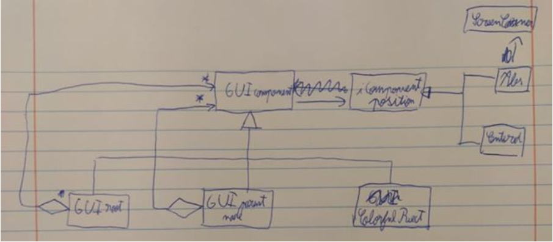
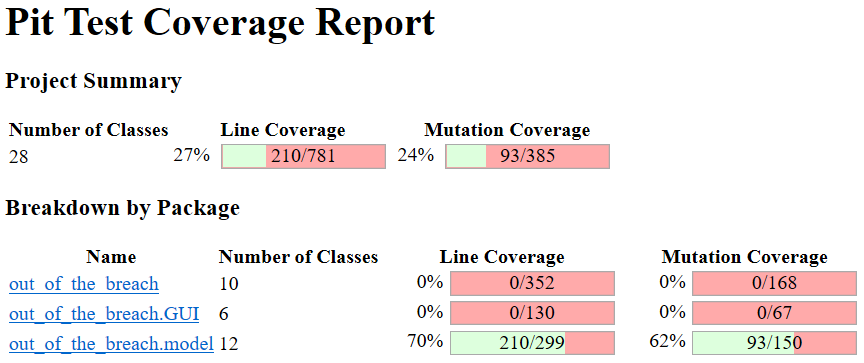

LPOO Intermediate report

#Navigation notes
Use the arrow keys, `M`, `A` and `Esc` no navigate the GUI.

#Implemented Features
The GUI is almost fully implemented and a major portion of the game logic is already in the model. However, the enemy has a very rudimentary AI and the End turn button functionality isn’t implemented (the button is there, but pressing `Enter` doesn’t do much).

#Planned Features
Now that the foundations of the game are in place, we can focus on adding more “meat” to game, namely, implement some better enemy AI and the high-level functions of the game, allowing the “End Turn” functionality to be implemented. We also intend to add a starting menu and victory conditions to the game. A way to store and load maps would also be an interesting feature to implement.

#Design
* Strategy Pattern
In order to avoid violation of the Single Responsibility Principle, we separate the enemy from its attack method (AttackStrategy). This allows us to easily change and design the types of attacks in our game.

* Composite pattern
The composite pattern is the core foundation of our GUI system. We leave here a rough UML sketch. (https://github.com/FEUP-LPOO/lpoo-2020-g21/tree/master/src/main/java/out_of_the_breach/GUI)

* MVC pattern
We managed to extract all the game logic to the model package (https://github.com/FEUP-LPOO/lpoo-2020-g21/tree/master/src/main/java/out_of_the_breach/model). However, the view and the controler are unified into the `GUIComponent`. This is more akin to the hierarquic MVC pattern.

#Known Code Smells and Refactoring Suggestions
In order to meet the intermediate delivery deadline, several corners were cut. We intend to cleanup the codebase in the following weeks.

* Switch Statements
MeleeAttack.getDamagedPosition( )
In this case, we could use some refactorings such as Replace Type Code with Subclass or Replace Type Code with State / Strategy. However, in the moment, we feel like that change may result in a much more confusing code as it will split important parts of our class.

* Message Chains
Model.getEntityAt( )
Bug.moveAndPlanAttack( )
To avoid the hard to read and understand message chains we can try to use temporary and meaningful variables to store part of the message so it becomes easier to understand.

* Data Class
Some of our classes, such as DamageMatrix and MovementMatrix, can be considered Data Classes as they are mainly a storage for data used by other classes and have no methods other than setters and getters. To solve this smell, it would be appropriate to relocate some methods that use the data on those classes to the data class itself or perhaps even .

#Testing
As you can see, we mostly focused on testing the GUI and model packages, as these are the most stable (i.e. finished) portions of the codebase.
## Coverage Report

##Mutation Testing Report

#Self-Evaluation
We consider that we both contributed substantially to the project and there aren’t any substantial disparities.
